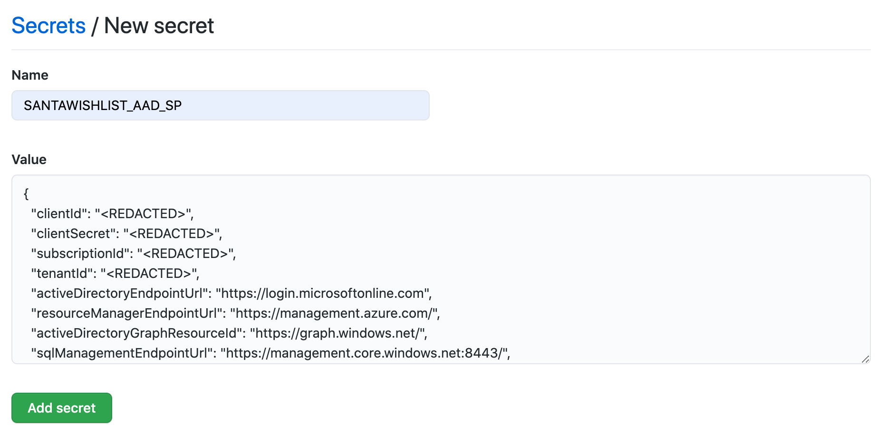

# Festive Azure Hackathon

This guide assumes you are familiar with using terraform, azure-cli and Github.

## Deploying the solution
### Getting set up
1. Clone or fork this repository.

2. Login to azure CLI using `az login` and select the appropriate subscription using the command `az account set -s <my-subscription-id>`

3. Run the following command to create a service principal that we will use for authenticating Github Actions.
```
az ad sp create-for-rbac --name "santawishlist-hackathon" --sdk-auth --role contributor \
--scopes /subscriptions/<my-subscription-id>
```
This command should give you an output that resembles the following
```
{
  "clientId": "<REDACTED>",
  "clientSecret": "<REDACTED>",
  "subscriptionId": "<REDACTED>",
  "tenantId": "<REDACTED>",
  ...
}
```
Copy the __entire__ JSON object and create a new Github Secret labelled `SANTAWISHLIST_AAD_SP`



4. Create a new storage account that we will use as our terraform state backend. Feel free to change the region to your preferred location.
```
REGION=westeurope
RESOURCE_GROUP=$(az group create -n santawishlist-tf-state-rg -l $REGION --query name | tr -d '"')
STORAGE_ACCOUNT=$(az storage account create -n santawishlisttstate$RANDOM -g $RESOURCE_GROUP -l $REGION --sku Standard_LRS --query name | tr -d '"')
az storage container create -n tfstate --account-name $STORAGE_ACCOUNT
echo $STORAGE_ACCOUNT
```

### Creating the infrastructure
This solution uses terraform to create the infrastructure that supports the application.

Update the terraform map variable `app_locations` in the `variables.tf` file to include each region you want to deploy to. For example, if I want to deploy to the _West Europe_ and _UK South_ regions, it would look like this. We need to be sure to include the valid [country codes](https://www.iban.com/country-codes) so that traffic gets routed correctly by traffic manager.
```
variable "app_locations" {
  type        = map
  description = "Configuration map for each app deployment."
  default = {
    westeurope = {
      country_code = "NL"
    },
    uksouth = {
      country_code = "GB"
    }
  }
}
```
We also need to configure the storage account that we created earlier as our backend state. Replace the value `<my-storage-account-name>` inside of the `terraform.tf` file
```
terraform {
  backend "azurerm" {
    resource_group_name  = "santawishlist-tf-state-rg"
    storage_account_name = "<my-storage-account-name>"
    container_name       = "tfstate"
    key                  = "santawishlist.terraform.tfstate"
  }
}
```
Save the code, create a new commit and push up to the `main` branch.

### Creating the Infrastructure
Our terraform and container image is deployed using Github actions. After you pushed your first commit up to the branch, this will begin a pipeline that will apply terraform, build the container image, and push it to ACR. Once the image is pushed to ACR, the App services are configured to pull down the latest version of the container image.

