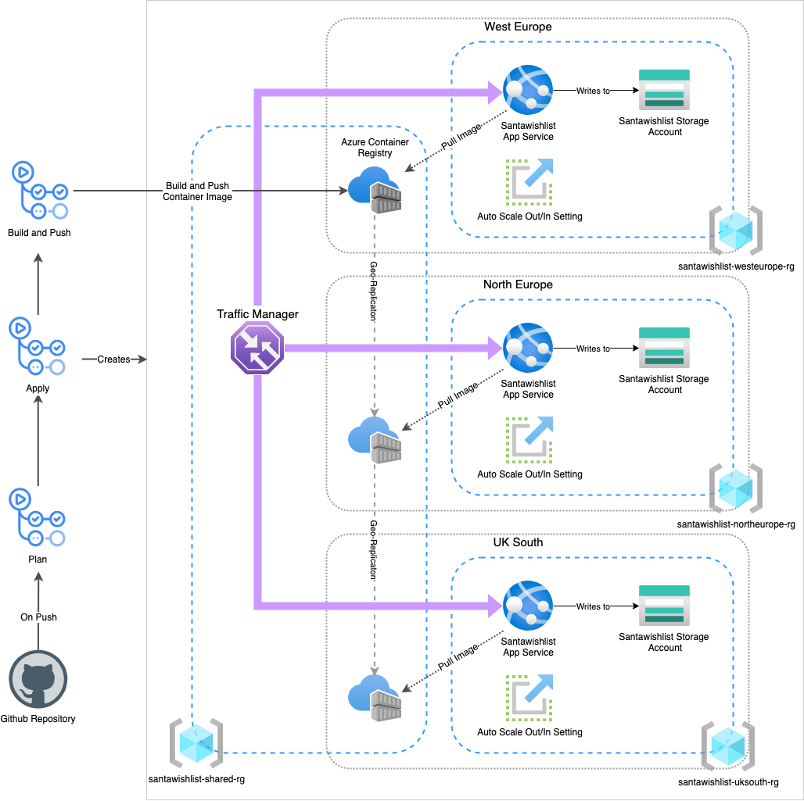
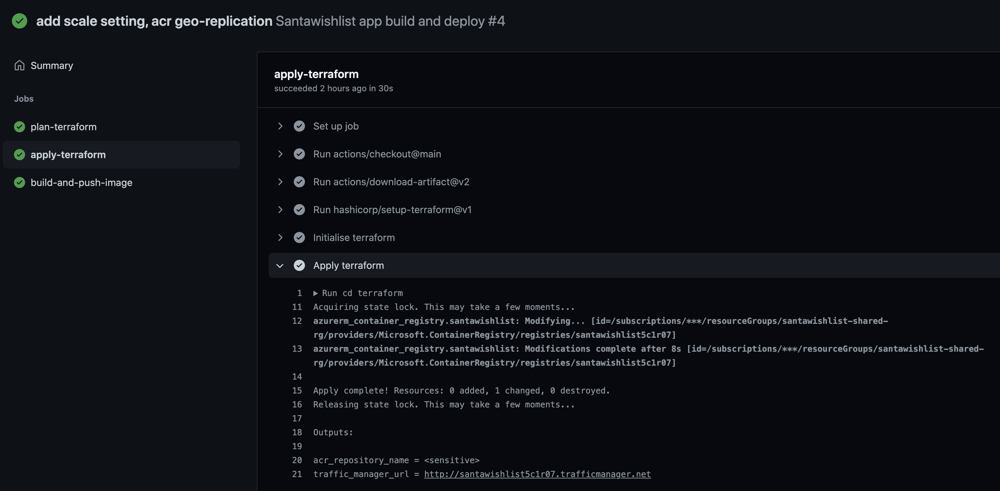
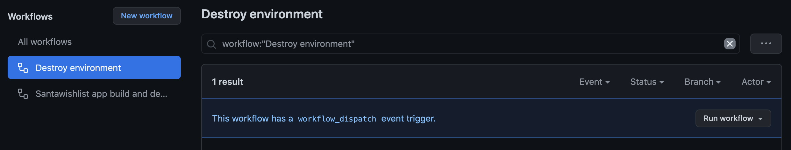

# Festive Azure Hackathon

## Solution Architecture

<p align="center">
  
</p>

## Website hosting and scaling
The solution makes use of the Azure App Service for hosting the application. This uses a Linux App service plan with containers. Images are stored in ACR and pulled in whenever the image is updated using the continuous deployment feature. ACR is geo-replicated so that the image is highly available, with a copy local to each app service. A scale setting has been configured to satisfy the scaling requirement for the application, with _CpuPercentage_ as the scaling metric. This is configured to scale up during busy periods, and scale down when it is quieter. 

## Personalisation and Data compliance
An App Service is deployed into each region that is specified. Traffic Manager uses geo-mappings to identity the country that a request originates from, and then route it to the appropriate App Service. A Storage Account is deployed alongside the App Service in a region, ensuring data locality.

---
## Getting set up 🛠
> This guide assumes you are familiar with terraform, azure-cli and Github. The steps assume that you are running them from within a bash session.

Unfortunately there are some manual steps when setting up this demo. I tried to keep them to a minimum, but there are nuances when it comes to the terraform azurerm provider, such as [not supporting service principal login via azure-cli](https://registry.terraform.io/providers/hashicorp/azurerm/latest/docs/guides/azure_cli#important-notes-about-authenticating-using-the-azure-cli).

1. Clone or fork this repository.

2. Login to azure CLI using `az login` and select the appropriate subscription using the command `az account set -s <my-subscription-id>`

3. Run the following command to create a service principal that we will use for authenticating Github Actions.
```
az ad sp create-for-rbac --name "santawishlist-hackathon" --sdk-auth --role contributor \
--scopes /subscriptions/<my-subscription-id>
```
This command should give you an output that resembles the following:
```
{
  "clientId": "<REDACTED>",
  "clientSecret": "<REDACTED>",
  "subscriptionId": "<REDACTED>",
  "tenantId": "<REDACTED>",
  ...
}
```
Use the above values to create the following secrets in your Github repository.
- `ARM_CLIENT_ID`
- `ARM_CLIENT_SECRET`
- `ARM_SUBSCRIPTION_ID`
- `ARM_TENANT_ID`

4. Create a new storage account that we will use as our terraform state backend. Feel free to change the region to your preferred location.
```
REGION=westeurope
RESOURCE_GROUP=$(az group create -n santawishlist-tf-state-rg -l $REGION --query name | tr -d '"')
STORAGE_ACCOUNT=$(az storage account create -n santawishlisttstate$RANDOM -g $RESOURCE_GROUP -l $REGION --sku Standard_LRS --query name | tr -d '"')
az storage container create -n tfstate --account-name $STORAGE_ACCOUNT
echo $STORAGE_ACCOUNT
```


5. Update the terraform map variable `app_locations` in the `variables.tf` file to include each region you want to deploy to. For example, if I want to deploy to the _West Europe_ and _UK South_ regions, it would look like the following:
```
variable "app_locations" {
  type        = map
  description = "Configuration map for each app deployment."
  default = {
    westeurope = {
      country_codes = ["NL"]
    },
    northeurope = {
      country_codes = ["IE"]
    },
    uksouth = {
      country_codes = ["GB"]
    }
  }
}
```
> ⚠️ Be sure to include the valid [country codes](https://www.iban.com/country-codes) so that traffic gets routed correctly by traffic manager.

6. (Optional)  Change the value of the `primary_region` variable if you would like your shared resource group in a different location. Default value is `westeurope`.

6. Configure the storage account that we created earlier as our backend state. Replace the value `<my-storage-account-name>` inside of the `terraform.tf` file
```
terraform {
  backend "azurerm" {
    resource_group_name  = "santawishlist-tf-state-rg"
    storage_account_name = "<my-storage-account-name>"
    container_name       = "tfstate"
    key                  = "santawishlist.terraform.tfstate"
  }
}
```
7. Save the code, commit and push to the `main` branch.
---
## Creating the Infrastructure 🏗
Our terraform and container image is deployed using Github Actions. After you push your first commit up to the branch, it will begin a workflow that will apply terraform, build the container image, and push it to ACR. Once the image is pushed to ACR, the App services are configured to pull down the latest version of the container image.

Once the image has been successfully pushed, the app services should pull the container image soon afterwards and serve the application. To find out your traffic manager URL you can either go to the `apply-terraform` Job in the Github Workflow and at the end of the "Apply terraform" step, terraform will have output the Traffic Manager URL.

<p align="center">
  
</p>

Alternatively you can look at the resource in the Azure Portal and get it from the Traffic Manager profile resource.

You can freely add and remove regions to the variable map and upon pushing the code to Github it will update the resources to reflect the desired state.

## Cleaning up 🧹
1. Run the __Destroy environment__ workflow. This can be manually invoked by selecting the Run workflow button after selecting the workflow.
<p align="center">
  
</p>

2. Once the above workflow has successfully run, then you will need to clean up the resources that we created manually. You can paste the following code:
```
az group delete --name santawishlist-tf-state-rg --yes
SP_ID=$(az ad sp list --display-name santawishlist-hackathon --query [].appId --output tsv)
az ad sp delete --id $SP_ID
```
3. Delete this repository!
